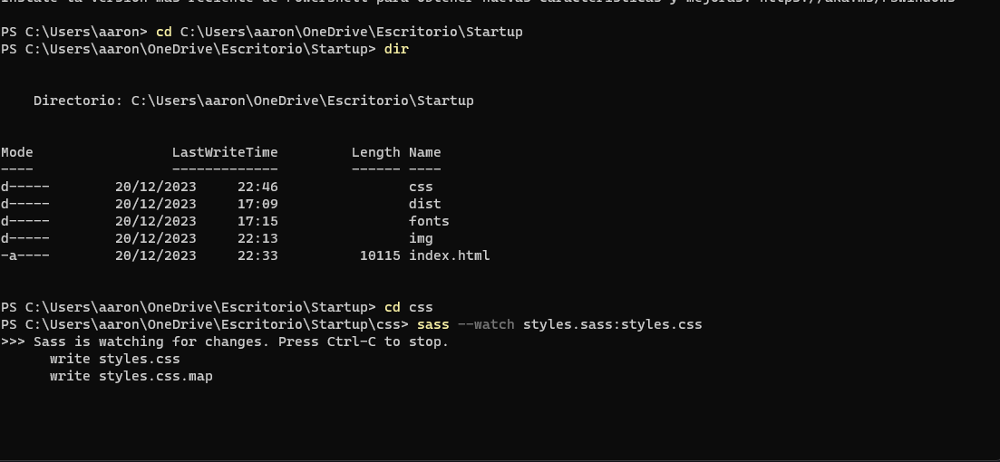

### Startup

In my repository, I employ the sass --watch command in the command line to efficiently convert my SASS files to CSS. By using this command with the syntax sass --watch styles.sass:styles.css, I establish a dynamic connection that automatically updates my CSS file whenever I make changes to the SASS file. This approach streamlines the development process, allowing me to instantly visualize modifications in real-time when working with my HTML file. The integration of SASS in my repository enhances the structure and maintenance of my styles, optimizing the web development experience.

### Project Presentation

### Project Presentation

